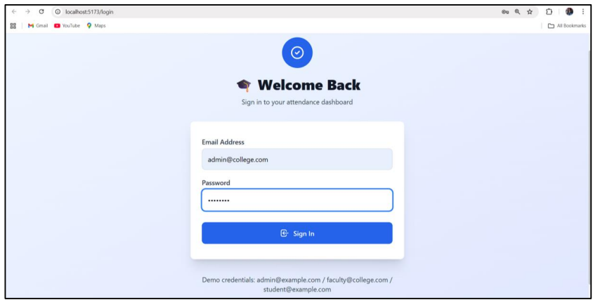
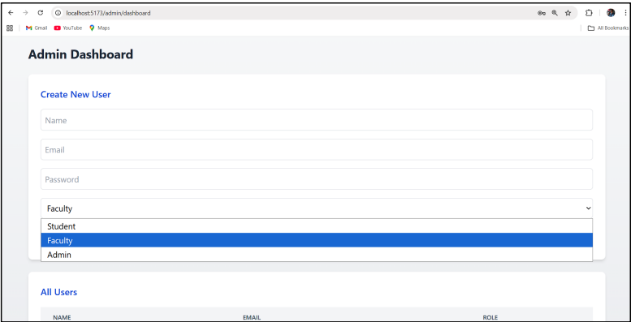
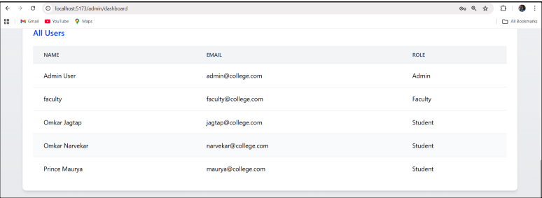
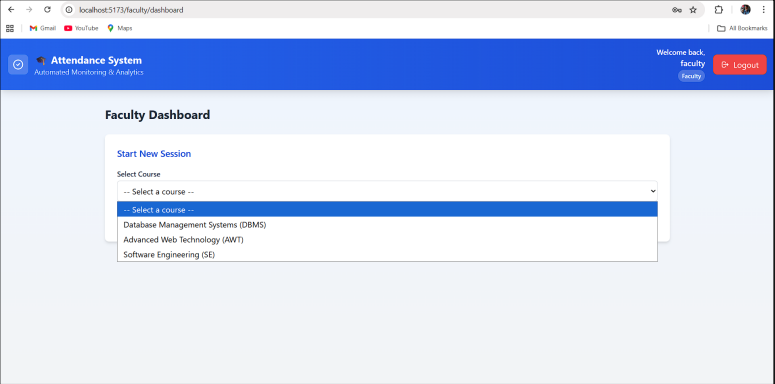
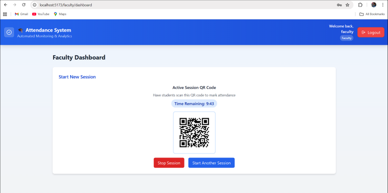
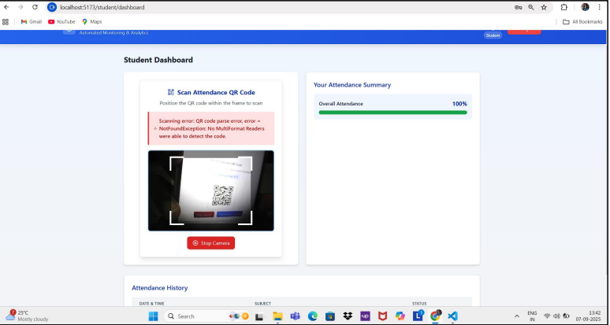
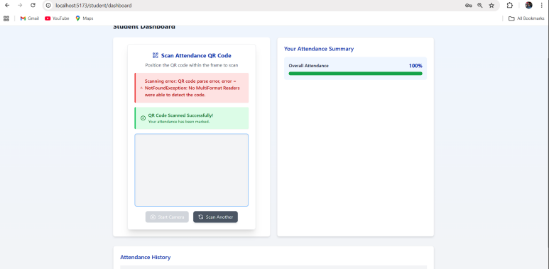
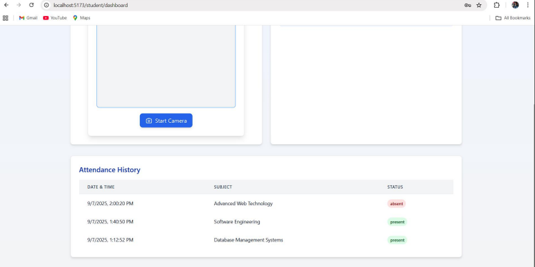
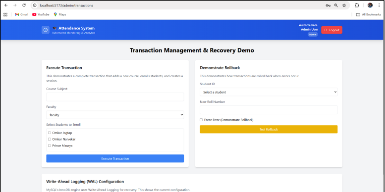

<div align="center">


# Attendance System

**QR-based attendance tracking for colleges — no proxy, no paperwork.**

[](https://react.dev)
[](https://nodejs.org)
[](https://expressjs.com)
[](https://dev.mysql.com)
[](https://jwt.io)
[](LICENSE)

<br/>

[✨ Features](#-features) • [🚀 Quick Start](#-quick-start) • [📸 Screenshots](#-screenshots) • [🗄️ Database](#️-database) • [🔌 API Reference](#-api-reference) • [🧪 Tests](#-tests)

</div>

---

## What is this?

A **full-stack web app** that replaces manual roll calls with time-bound QR codes. Faculty generate a QR code per class — students scan it to mark attendance. The code expires in 15 minutes. Proxy is impossible.

Three roles. One system.

```
 Admin              Faculty                  Student
  │                    │                        │
  ├─ Create users       ├─ Start session          ├─ Scan QR code
  ├─ Manage courses     ├─ Generate QR (15 min)   ├─ View attendance %
  └─ View all data      └─ View reports           └─ View history
```

```
Faculty clicks "Start Session"
       │
       ▼
Backend creates session → saves to MySQL → returns session_id
       │
       ▼
QR Service generates QR string → displayed on Faculty screen (⏱ 15 min timer)
       │
       ▼
Student scans QR → Backend validates session (active? within 15 min? not duplicate?)
       │
    ┌──┴──────────────────────────────────┐
  [Valid]                              [Expired / Duplicate]
    │                                      │
    ▼                                      ▼
BEGIN TRANSACTION                    ROLLBACK
markAttendance(student, session)     Return error to student
COMMIT → "Attendance Marked ✅"
```
---

## ✨ Features

**Admin**
- Create and manage student/faculty accounts with role assignment
- View all system users in a live dashboard
- Access Transaction Management demo page (COMMIT / ROLLBACK)

**Faculty**
- Create courses and start live attendance sessions
- Auto-generated time-bound QR code displayed on screen with a countdown timer
- View attendance reports per course

**Student**
- Scan QR code directly from browser camera — no app needed
- Real-time attendance percentage per course
- Full attendance history table (date, subject, status)

**System**
- JWT-based auth with role-based access control (RBAC)
- ACID-compliant MySQL transactions — rollback on any failure
- Duplicate scan prevention via `UNIQUE(student_id, session_id)` constraint
- Write-Ahead Logging (WAL) via MySQL InnoDB for crash recovery
- Validation on both frontend (React) and backend (Express middleware)

## 📸 Screenshots

<table>
  <tr>
    <td align="center">
      <br/>
      <sub><b>Login Page</b></sub>
    </td>
    <td align="center">
      <br/>
      <sub><b>Admin Dashboard</b></sub>
    </td>
    <td align="center">
      <br/>
      <sub><b>All Users View</b></sub>
    </td>
  </tr>
  <tr>
    <td align="center">
      <br/>
      <sub><b>Faculty — Start Session</b></sub>
    </td>
    <td align="center">
      <br/>
      <sub><b>Live QR Code (15 min timer)</b></sub>
    </td>
    <td align="center">
      <br/>
      <sub><b>Student QR Scanner</b></sub>
    </td>
  </tr>
  <tr>
    <td align="center">
      <br/>
      <sub><b>Attendance Marked ✅</b></sub>
    </td>
    <td align="center">
      <br/>
      <sub><b>Attendance History</b></sub>
    </td>
    <td align="center">
      <br/>
      <sub><b>Transaction Demo Page</b></sub>
    </td>
  </tr>
</table>

### Prerequisites
- Node.js v18+
- MySQL 8+
- npm or yarn

### 1. Clone
```bash
git clone https://github.com/omkarjagtap120/attendance-system.git
cd attendance-system
```

### 2. Database Setup
```bash
# Log into MySQL and run:
mysql -u root -p < database/schema.sql
mysql -u root -p attendance_system < database/seed.sql
```

### 3. Backend Setup
```bash
cd backend
npm install
```

Create a `.env` file inside `/backend`:
```env
DB_HOST=localhost
DB_USER=root
DB_PASSWORD=your_password
DB_NAME=attendance_system
JWT_SECRET=your_jwt_secret_key
PORT=5173
```

```bash
npm start
# Backend runs at http://localhost:5173
```

### 4. Frontend Setup
```bash
cd ../frontend
npm install
npm run dev
# Frontend runs at http://localhost:5174
```

### 5. Demo Credentials
| Role | Email | Password |
|---|---|---|
| Admin | admin@college.com | admin123 |
| Faculty | faculty@college.com | faculty123 |
| Student | jagtap@college.com | student123 |

---

## 📁 Project Structure

```
attendance-system/
│
├── frontend/                  # React.js app
│   ├── src/
│   │   ├── pages/
│   │   │   ├── Login.jsx
│   │   │   ├── AdminDashboard.jsx
│   │   │   ├── FacultyDashboard.jsx
│   │   │   └── StudentDashboard.jsx
│   │   ├── components/
│   │   │   ├── QRScanner.jsx       # Camera-based QR scanner
│   │   │   ├── Navbar.jsx
│   │   │   └── AttendanceTable.jsx
│   │   └── utils/
│   │       └── api.js              # Axios instance + interceptors
│
├── backend/                   # Node.js + Express API
│   ├── routes/
│   │   ├── auth.js             # /api/auth/*
│   │   ├── sessions.js         # /api/session/*
│   │   ├── attendance.js       # /api/attendence/*
│   │   └── admin.js            # /api/admin/*
│   ├── middleware/
│   │   ├── auth.js             # JWT verification
│   │   └── rbac.js             # Role-based access control
│   └── db.js                  # MySQL connection pool
│
└── database/
    ├── schema.sql             # All CREATE TABLE statements
    └── seed.sql               # Sample data
```
---

## 🗄️ Database

### Schema Overview

```sql
users         → base table (user_id, name, email, password, role ENUM)
  ├── students    → ISA (student_id, rollno, user_id FK)
  └── faculty     → ISA (faculty_id, department, user_id FK)

courses       → (course_id, subject, faculty_id FK)
sessions      → (session_id, course_id FK, faculty_id FK, start_time, end_time, qr_code)
attendance    → (att_id, student_id FK, session_id FK, status, timestamp)
              → UNIQUE(student_id, session_id)   ← prevents duplicate scans
student_courses → junction table for M:N enrollment
```
### Key Design Decisions

**Why `UNIQUE(student_id, session_id)` on attendance?**
This DB-level constraint is the last line of defence against proxy or double-scan. Even if the API is called twice simultaneously, MySQL will reject the second insert.

**Why transactions for enrollment?**
Creating a course and enrolling students are wrapped in a single transaction. If any student ID is invalid, the entire operation rolls back — no half-created courses left in the database.

```sql
START TRANSACTION;
  INSERT INTO courses (subject, faculty_id) VALUES ('Database Management Systems', 1);
  SET @new_course_id = LAST_INSERT_ID();
  INSERT INTO student_courses (student_id, course_id) VALUES (101, @new_course_id), (102, @new_course_id);
COMMIT;

-- If student ID 999 doesn't exist → foreign key violation → ROLLBACK
```
### Useful Queries

```sql
-- Student-wise attendance percentage
SELECT s.rollno, u.name,
  SUM(CASE WHEN a.status='present' THEN 1 ELSE 0 END) / COUNT(*) * 100 AS attendance_pct
FROM attendance a
JOIN students s ON a.student_id = s.student_id
JOIN users u ON s.user_id = u.user_id
GROUP BY s.student_id;

-- Subject-wise total present count
SELECT c.subject, COUNT(a.att_id) AS total_present
FROM attendance a
JOIN sessions se ON a.session_id = se.session_id
JOIN courses c ON se.course_id = c.course_id
WHERE a.status = 'present'
GROUP BY c.subject;
```
---

## 🔌 API Reference

### Auth
| Method | Endpoint | Body | Description |
|---|---|---|---|
| `POST` | `/api/auth/register` | `{name, email, password, role}` | Register user |
| `POST` | `/api/auth/login` | `{email, password}` | Login, returns JWT |

### Sessions (Faculty)
| Method | Endpoint | Body | Description |
|---|---|---|---|
| `POST` | `/api/session/create` | `{course_id}` | Start session, generate QR |
| `GET` | `/api/session/:id` | — | Get session details |
| `PUT` | `/api/session/:id/stop` | — | End session early |

### Attendance (Student)
| Method | Endpoint | Body | Description |
|---|---|---|---|
| `POST` | `/api/attendence/mark` | `{qr_code}` | Mark attendance via QR |
| `GET` | `/api/attendence/student/:id` | — | Get attendance history |

### Courses & Users
| Method | Endpoint | Description |
|---|---|---|
| `GET` | `/api/course/:student/:studentID` | Get courses for student |
| `GET` | `/api/student/:id/dashboard` | Student dashboard data |
| `GET` | `/api/admin/users` | All users (Admin only) |
| `POST` | `/api/admin/users` | Create user (Admin only) |

> All routes except `/api/auth/*` require `Authorization: Bearer <token>` header.

---

## 🧪 Tests

### Functional Test Cases

| ID | Scenario | Status |
|---|---|---|
| FTC_001 | QR code generates for valid session with 15-min timer | ✅ Pass |
| FTC_002 | Student marks attendance by scanning valid QR | ✅ Pass |
| FTC_003 | Admin creates user with correct role assignment | ✅ Pass |

### Boundary Test Cases

| ID | Scenario | Status |
|---|---|---|
| BTC_001 | QR scanned at 10:15:01 (1 second after 15-min expiry) — scan rejected | ✅ Pass |
| BTC_002 | Email at exactly 100 chars accepted; 101 chars rejected | ✅ Pass |
| BTC_003 | Duplicate QR scan in same session | ❌ Fail — duplicate entry allowed (open issue) |

### Known Issue — BTC_003
Duplicate scan prevention currently relies on the API layer only. The `UNIQUE(student_id, session_id)` constraint is defined in the schema but the error response is not properly surfaced to the frontend.

**Fix needed in** `backend/routes/attendance.js`:
```js
// Handle MySQL duplicate entry error (ER_DUP_ENTRY → errno 1062)
if (err.code === 'ER_DUP_ENTRY') {
  return res.status(409).json({ message: 'Attendance already marked for this session.' });
}
```

---

## 🛠️ Tech Stack

| Layer | Technology |
|---|---|
| Frontend | React.js, Axios, TailWindCSS |
| Backend | Node.js, Express.js |
| Database | MySQL 8 |
| Auth | JSON Web Tokens (JWT) |
| QR Generation | Server-side UUID → QR string |
| QR Scanning | Browser camera via `jsQR` / html5-qrcode |

### Open Issues / Ideas
- [ ] Fix BTC_003 — surface duplicate scan error to frontend
- [ ] Add attendance % threshold alert (e.g., warn below 75%)
- [ ] Export attendance report as CSV / PDF
- [ ] Push notifications for upcoming sessions
- [ ] Dark mode

<div align="center">
Built with React · Node.js · MySQL | GHRCEM Mini Project
</div>
